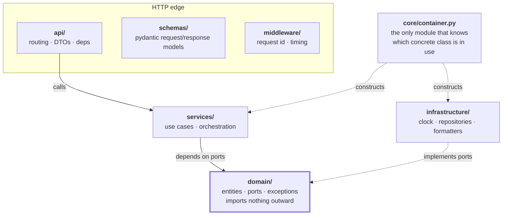
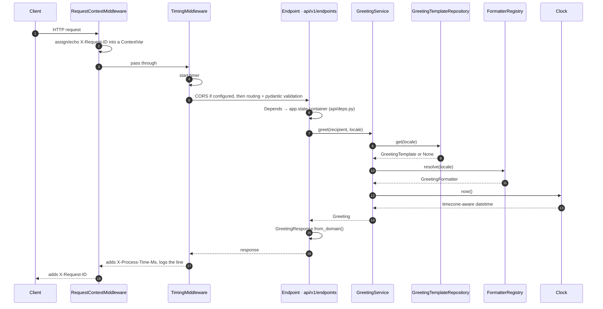

# Architecture

This service is a hello-world in behaviour and a production template in
structure. This document explains the structure, why it is shaped this way, and
how to extend it without eroding it.

---

## The one rule

**Dependencies point inwards.**



`domain/` sits at the centre and imports nothing from the layers around it —
not `fastapi`, not `pydantic`, not `infrastructure`. Everything outward-facing
reaches it through a `Protocol`.

**Why this matters practically:** the greeting rules can be unit-tested in
microseconds with no HTTP client, no event loop juggling, and no mocking
library. Swapping the in-memory template store for Postgres touches exactly one
line outside `infrastructure/`.

---

## Layer responsibilities

| Layer | Owns | Must never |
| ----- | ---- | ---------- |
| `domain/` | Entities (`Greeting`, `GreetingTemplate`), ports, domain exceptions, invariants | Import a framework; know about HTTP, JSON, or storage |
| `services/` | Use cases: sequencing domain operations, applying rules that span entities | Construct its own dependencies; know about `Request`/`Response` |
| `infrastructure/` | Adapters implementing ports: clocks, repositories, formatters, future HTTP/DB clients | Contain business rules; be imported by `domain/` or `services/` |
| `api/` + `schemas/` | Routing, validation, DTO↔domain translation, status codes | Contain business logic; catch domain errors inline |
| `core/` | Config, logging, error→status mapping, and the composition root | Be imported by `domain/` |
| `middleware/` | Cross-cutting request concerns | Know anything about greetings |

---

## Ports and adapters

Every port is a `typing.Protocol` in `domain/ports.py`:

```python
@runtime_checkable
class Clock(Protocol):
    def now(self) -> datetime: ...
```

Structural typing means `SystemClock` never imports `Clock` — it simply has a
matching `now()`. mypy verifies the match wherever one is passed for the other,
and `runtime_checkable` lets the test suite assert conformance explicitly
(`tests/unit/test_infrastructure.py::test_adapters_satisfy_their_ports`).

Current ports:

| Port | Implementations |
| ---- | --------------- |
| `Clock` | `SystemClock`, `FrozenClock` |
| `GreetingTemplateRepository` | `InMemoryGreetingTemplateRepository` |
| `GreetingFormatter` | `DefaultFormatter`, `JapaneseFormatter` |
| `GreetingUseCase` | `GreetingService` |

---

## The composition root

`core/container.py` is the single place where abstractions meet concretions:

```python
def build_container(settings: Settings) -> Container:
    clock: Clock = SystemClock()
    templates: GreetingTemplateRepository = InMemoryGreetingTemplateRepository()
    ...
```

`main.create_app()` builds it and attaches it to `app.state`; `api/deps.py`
hands the pieces to endpoints. The container is attached **eagerly** rather than
inside the lifespan handler so that any transport — including test clients that
never fire startup events — sees a fully wired application.

Tests build their own `Container` with a frozen clock and pass it straight to
`create_app()`. There is no dependency-override machinery to learn, because
there is nothing to override.

---

## How SOLID is actually used

Not a retrofit — each principle is doing work:

**Single responsibility.** `GreetingService` orchestrates and validates. It
does not render (formatters), store (repositories), read the clock (`Clock`),
serialise (`schemas/`), or decide status codes (`core/errors.py`). Each of those
has exactly one reason to change.

**Open/closed.** A new locale means a new formatter class plus one line in the
registry. `tests/unit/test_open_closed_extension.py` defines a formatter
*outside the package* and plugs it in without editing a single existing line —
that test exists specifically to keep this property honest.

**Liskov substitution.** Every formatter accepts the same arguments, returns a
`str`, and adds no preconditions. This is what makes `FormatterRegistry`'s
fallback safe: it can hand back `DefaultFormatter` for any unknown locale
without the caller noticing.

**Interface segregation.** Four separate one-or-two-method protocols rather
than one `GreetingBackend` god-interface. `FrozenClock` implements `now()` and
nothing else, because nothing else is asked of it.

**Dependency inversion.** `GreetingService.__init__` takes `templates`,
`formatters` and `clock` as parameters typed against protocols. High-level
policy does not depend on low-level detail; both depend on the abstraction.

---

## Request lifecycle



Errors short-circuit into `core/errors.py`, which turns any `DomainError` into
an RFC 9457-style problem document carrying the request id. Unhandled
exceptions are logged with a traceback and returned masked — internal detail
never reaches the client.

---

## Extension recipes

### Add a locale

1. Add the pattern to `DEFAULT_TEMPLATES` in
   `infrastructure/repositories/in_memory.py`.
2. If it needs special rules, add a formatter in `infrastructure/formatters/`
   and register it in `build_container`.
3. Add a case to `test_greets_in_each_locale`.

### Replace the in-memory store with a database

1. Write `infrastructure/repositories/sql.py` implementing
   `GreetingTemplateRepository`.
2. Change the one line in `build_container`.
3. Add connection settings to `core/config.py`.
4. Open/close the connection pool in the `lifespan` handler in `main.py`.

Nothing in `services/`, `domain/` or `api/` changes.

### Add a use case

1. Model any new concepts in `domain/models.py`; add ports for anything new it
   must talk to.
2. Write the service in `services/`, taking its collaborators as constructor
   arguments.
3. Add DTOs in `schemas/`, an endpoint in `api/v1/endpoints/`, and register the
   router in `api/v1/router.py`.
4. Wire it in `core/container.py`.
5. Unit-test the service; integration-test the endpoint.

### Add a new API version

Create `api/v2/` alongside `api/v1/` with its own router and schemas, and mount
it under a second prefix. Services are shared; only the edge is versioned.

---

## Deliberate trade-offs

This is more structure than a greeting endpoint needs. That is the point — it
is a template. Worth knowing what we chose and why:

- **`src/` layout** — tests import the installed package, so a broken packaging
  configuration fails locally instead of in production.
- **Protocols over ABCs** — no inheritance coupling, and adapters stay
  importable without the domain.
- **A hand-rolled container over a DI framework** — one readable function beats
  a decorator DSL at this scale. If the graph grows unwieldy, revisit it in an
  ADR.
- **Raw ASGI middleware over `BaseHTTPMiddleware`** — the latter runs in a
  separate task, which breaks `ContextVar` propagation to endpoints.
- **`async def` throughout** — even where nothing awaits, so that adding real
  I/O later is not a signature-churning refactor.
- **No database** — a hello-world does not need one, and the repository port
  shows exactly where one would attach.

---

## Architecture decision records

Significant decisions are recorded in [`adr/`](./adr). Add one when a choice is
hard to reverse, surprising, or likely to be re-litigated.

- [0001 — Record architecture decisions](./adr/0001-record-architecture-decisions.md)
